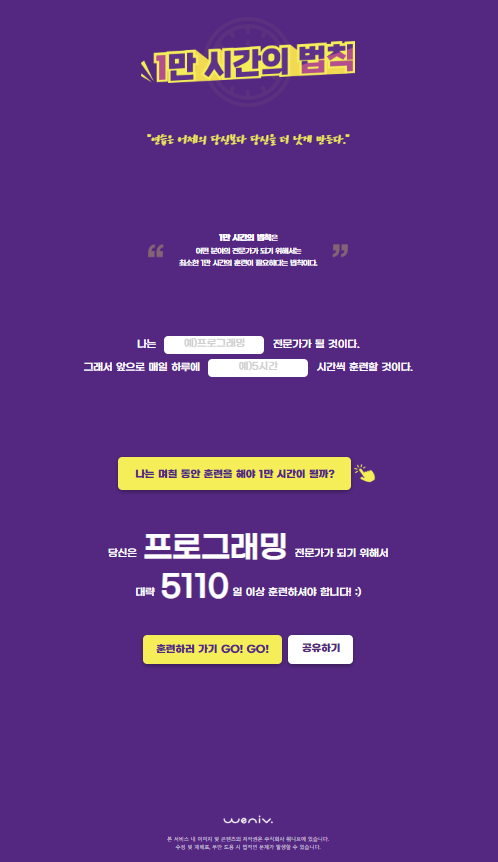

# 1만 시간의 법칙

HTML과 CSS만을 사용하여 **1만 시간의 법칙(The 10,000-Hour Rule)**을 주제로 제작한 반응형 웹 페이지입니다.
정적인 콘텐츠 구현을 목표로 하여 시맨틱 HTML 구조, CSS 레이아웃, 반응형 웹 설계에 집중해 제작한 학습용 프로젝트입니다.

* GitHub Pages 배포 ([1만 시간의 법칙](https://dongmyeongback.github.io/10thousandPage/))
* Desktop / Tablet / Mobile 전 해상도 대응

## 미리보기

| Desktop | Mobile |
|--------|--------|
|  |  |

---

## 프로젝트 개요

* **프로젝트 목적**
  HTML과 CSS의 기본기를 다지기 위해, 텍스트 중심의 콘텐츠를 구조적으로 설계하고
  반응형 레이아웃으로 구현하는 것을 목표로 한 프로젝트입니다.

  다음 항목에 집중하여 프로젝트를 진행했습니다.

  * 시맨틱 구조에 맞는 HTML 태그 설계
  * Flexbox를 활용한 레이아웃 구성
  * Media Query를 활용한 반응형 웹 구현

---

## 사용 기술

* **HTML**

  * 시맨틱 태그(`header`, `main`, `section`, `article`, `footer`, `nav`)
  * 문서 구조를 고려한 제목 계층(`h1~h3`) 설계
  * 접근성을 고려한 `alt`, `aria-label`, `sr-only` 활용

* **CSS**

  * Flex 기반 레이아웃
  * CSS 변수(`:root`)를 활용한 컬러 및 스타일 관리
  * Media Query를 활용한 반응형 디자인
  * Hover 상태 중심의 기본 UI 인터랙션

---

## 폴더 구조

```
├── index.html
├── styles/
│   ├── reset.css
│   └── style.css
├── images/
│   ├── click.png
│   ├── clock.png
│   ├── licat.png
│   └── ...
```

---

## 주요 기능

### 1. 헤더(Header)

* `<div class="header-logo" role="img" aria-labe웃
* **480px 이하**: 모바일 레이아웃

  * rem 단위를 활용한 유연한 크기 조절
  * 텍스트 영역 중심의 레이아웃 재배치
  * 여백 및 폰트 크기 단계적 조정

---

## 접근성 고려 사항

* 시각적으로 숨겨진 `sr-only` 사용
* `input` 을 사용할떄 입력창이 무엇인지 나타내기 위해 `label` 태그와 `sr-only` 사용
* 정보 전달용 이미지에 `alt` 텍스트 적용
* 내비게이션 및 주요 요소에 `aria-label` 사용

---

## 배운 점

* 시맨틱 HTML 구조 설계의 중요성
* 텍스트 중심 페이지에서의 레이아웃 구성 방법
* Media Query와 rem단위를 활용한 단계적 반응형 설계
* CSS를 활용한 구조적 스타일 관리의 필요성

---

## 개선 및 확장 아이디어

* JavaScript를 활용한 동적 인터랙션 추가
* 다크 모드 및 사용자 환경 설정 기능 확장
* 헤더 로고를 만들 때 `.header-logo::before` 와 `.header-logo::after`에 `background-image`를 사용했는데 이보다는 html에 img태그를 사용하는 것이 더 적절해 보임
```css
.header-logo::before {
    background-image: url('../images/clock.png');
}

.header-logo::after {
    background-image: url('../images/title.png');
}
```

* 특정 텍스트만 bold 처리를 할 때 새로운 class 를 만들기 보다 `class=bold`로 처리는게 재활용성이 높아 보임 
```html
<span class="law-description-text-bold">1만 시간의 법칙</span>은<br>
                    어떤 분야의 전문가가 되기 위해서는<br>
                    최소한 1만 시간의 훈련이 필요하다는 법칙이다.
```

---

## 제작자

* 이름: 백동명
* 학습 목적의 개인 프로젝트

## 개발 기간

* 개발 기간: 25.12.10 ~ 25.12.19
---

> 본 프로젝트는 HTML/CSS 학습을 목적으로 제작되었습니다.
